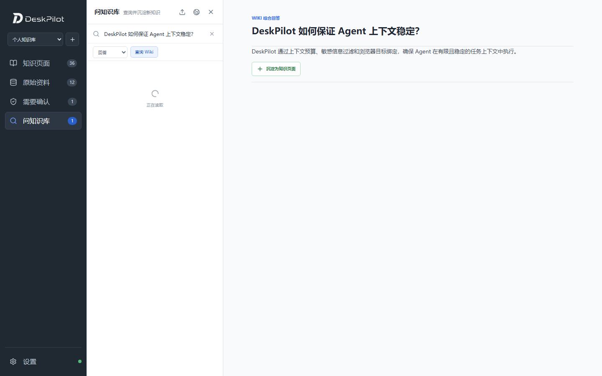
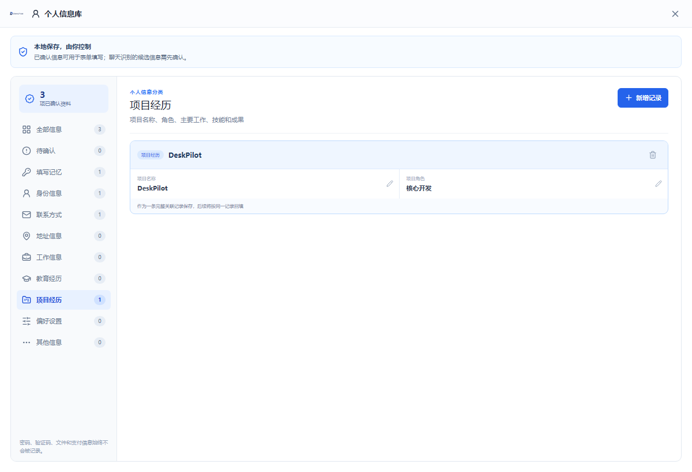
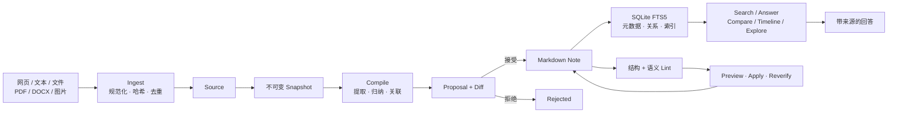
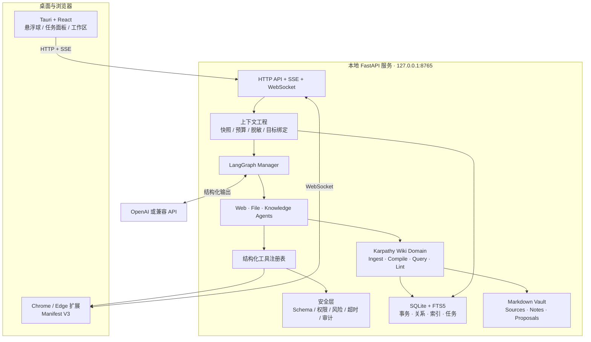
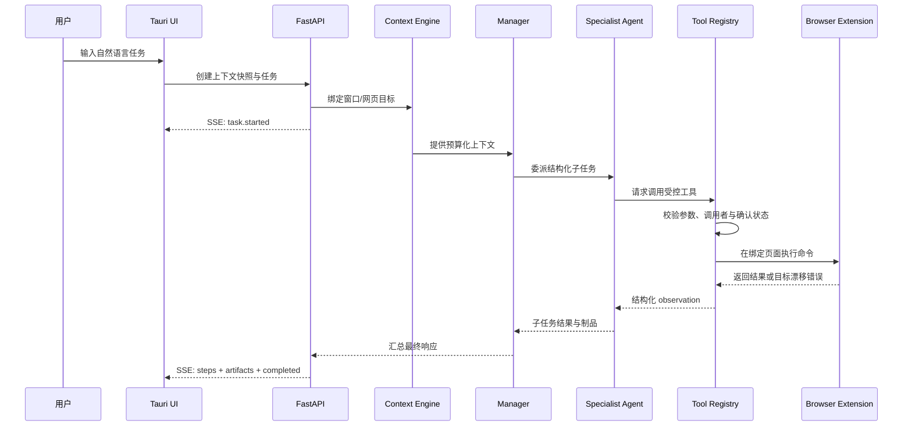

<div align="center">
  
  <h1>DeskPilot · 桌灵</h1>
  <p><strong>Karpathy Wiki 个人知识系统 × 可审计的 Windows Agent</strong></p>
  <p>让资料沉淀为可追溯、可演进的长期知识，也让自然语言任务通过受控工具真正执行。</p>
</div>

> [!NOTE]
> DeskPilot 当前是可运行、可测试的个人工程项目，还不是面向最终用户发布的成熟产品。浏览器任务、知识库与智能表单链路已经实现；通用 Desktop Agent 与正式安装包仍在开发计划中。

## 项目概览

DeskPilot 由两个可以独立使用、又能互相连接的核心系统组成：

| 核心系统                           | 解决的问题                                           | 主要能力                                                                      |
| ---------------------------------- | ---------------------------------------------------- | ----------------------------------------------------------------------------- |
| **Karpathy Wiki 个人知识库** | 收藏的资料如何变成长期可维护、可追溯的知识           | Ingest、不可变快照、Compile、Proposal Review、FTS5 + 关系检索、Lint、备份恢复 |
| **桌面 Agent 执行系统**      | 大模型如何在有限、稳定、可审计的上下文中完成真实任务 | 上下文绑定、Manager 委派、结构化工具、风险确认、SSE 过程反馈                  |

两个系统通过浏览器通道衔接：Agent 可以采集当前页面、把资料交给 Wiki 编译，也可以基于知识库证据回答问题或生成任务制品。

**Agent 执行链路**

```text
“总结当前网页并保存”
        ↓
捕获并绑定当前浏览器目标
        ↓
Manager 理解目标并委派 Web / File Agent
        ↓
工具调用、参数校验、风险检查与执行
        ↓
SSE 实时反馈步骤，最终返回 Markdown 制品
```

**Wiki 知识链路**

```text
采集网页 / 文件 / 文本 → 不可变来源快照 → 编译知识提案 → Diff 审核
→ Markdown 知识页 → FTS5 + 关系检索 → 带证据回答 → Lint 与持续维护
```

核心能力包括：

- Karpathy Wiki：以 Markdown 为长期真相、SQLite 为控制面，覆盖知识从采集到维护的完整生命周期。
- Tauri 多窗口桌面 UI：悬浮球、快捷菜单、任务面板、设置、知识库与个人信息库。
- Manager + Specialist Agents：结构化理解、委派 DAG、专业 Agent 隔离和结果汇总。
- 浏览器上下文通道：Chrome/Edge Manifest V3 扩展、本地 WebSocket、标签页与文档快照绑定。
- 智能表单：字段识别、个人信息映射、填写预览、显式确认、SPA 跳转与页面漂移保护。
- 工具安全边界：JSON Schema 校验、调用者白名单、风险分级、超时、审计步骤和敏感信息过滤。

## 界面预览

<table>
  <tr>
    <td width="50%">
      
    </td>
    <td width="50%">
      
    </td>
  </tr>
  <tr>
    <td align="center"><strong>知识库工作台</strong><br/>本地资料管理、结构化问答与知识提案</td>
    <td align="center"><strong>个人信息库</strong><br/>分类资料、项目经历与站点填写记忆</td>
  </tr>
</table>

<sub>截图使用固定演示数据生成，不包含真实个人信息。</sub>

## Karpathy Wiki：可持续演进的个人知识系统

该模块受到 Andrej Karpathy 的 [LLM Wiki 构想](https://gist.github.com/karpathy/442a6bf555914893e9891c11519de94f)启发，但没有把外部 Wiki 项目作为运行时依赖，也不是在向量数据库外面简单包一层问答界面。

DeskPilot 将它实现为一套完整的知识生命周期：**原始资料与知识页面分离、来源快照不可静默覆盖、AI 修改先形成可审核提案、回答必须携带证据、索引和数据库可以从 Markdown 重建。**



### 知识数据模型

| 对象         | 含义                                             | 关键约束                                                          |
| ------------ | ------------------------------------------------ | ----------------------------------------------------------------- |
| `Profile`  | 一套独立知识空间及其 purpose、来源和笔记成员关系 | 通过`profile.yaml` 保留可重建信息，支持多知识库切换             |
| `Source`   | URL、文件或用户文本代表的逻辑来源                | canonical URI 稳定标识，同一来源不会因重复采集而复制              |
| `Snapshot` | 某个时间点实际采集到的来源版本                   | 内容哈希去重；新版本新增快照，不覆盖旧版本                        |
| `Note`     | 用户主要阅读和编辑的稳定知识页面                 | Markdown 正文包含 Summary、Overview、Details、Evidence、Relations |
| `Proposal` | 模型生成、尚未合并的结构化修改                   | 展示 Diff，携带基准哈希，版本冲突时拒绝静默覆盖                   |
| `Relation` | 知识页面间的有类型连接                           | 同时服务关系扩展检索和可解释路径展示                              |

### 从资料到知识

1. **Ingest**：从当前网页、粘贴文本、本地 Markdown/TXT、PDF、DOCX 或图片采集内容；扫描 PDF 和图片可进入本地 OCR 流程。
2. **Snapshot**：规范化来源 URI、计算 SHA-256，并保存不可变快照。同 URI 同哈希直接去重，同 URI 新内容创建新版本并把关联 Note 标为 stale。
3. **Compile**：模型输出受 Pydantic Schema 约束的知识操作；确定性代码负责路径限制、结构校验、关系验证和最终落盘。
4. **Review**：更新已有 Note 时生成 Proposal 和统一 Diff；使用基准内容哈希进行乐观并发检查，保护用户在提案生成后的人工编辑。
5. **Index**：提交成功后更新 SQLite 元数据、关系与 FTS5；Markdown 仍是可阅读、可迁移和可重建的长期事实来源。

### 检索不是只有一种问答模式

| 模式         | 行为                                             |
| ------------ | ------------------------------------------------ |
| `search`   | 返回匹配的知识页和来源，不调用模型生成结论       |
| `answer`   | 基于召回证据回答，并返回 Note、Source 与证据包   |
| `compare`  | 对候选主题做确定性的字段、标签和差异比较         |
| `timeline` | 从知识元数据和内容中整理时间事件序列             |
| `explore`  | 双向扩展知识关系，返回节点、边和可继续追问的问题 |

检索先使用标题、别名、标签、中文分词 FTS5 和关系扩展召回，再按任务选择 L0–L3 阅读深度：从一句摘要逐步读取到完整 Note 和原始 Snapshot，避免每次都把全部资料塞进模型上下文。

### 长期使用需要的工程能力

- **并发一致性**：SQLite 租约锁保护 Source/Note 写入；Proposal 基准哈希阻止过期修改覆盖新版本。
- **后台任务**：Compile、Lint、Semantic Lint、Rebuild 和完整备份支持持久任务、SSE 进度、取消、重试与崩溃恢复。
- **知识维护**：结构 Lint 检查缺失文件、孤立页面、断链、哈希和索引漂移；语义 Lint 提供可预览、执行、再次验证的修复闭环。
- **生命周期**：Archive 保留内容但退出默认检索；Trash 采用软删除并支持恢复，避免管理操作直接造成不可逆丢失。
- **灾难恢复**：完整备份包含 Markdown Vault、数据库与校验清单；恢复前先生成安全备份，并校验路径和 SHA-256。
- **开放格式**：知识正文始终是普通 Markdown，可选导出到 Obsidian；不要求用户绑定专有编辑器或向量数据库。

这一部分不是设计稿占位：核心实现位于 `backend/app/knowledge/`，包含 20 多个领域模块和 50 个知识库专项后端测试；前端工作区位于 `frontend/src/views/KnowledgeWorkspace.tsx`。

## 已实现能力与边界

| 模块           | 当前状态  | 说明                                                                  |
| -------------- | --------- | --------------------------------------------------------------------- |
| 桌面 UI        | ✅ 已实现 | Tauri 多窗口、悬浮球、快捷菜单、任务状态与 GSAP 动效                  |
| Agent 编排     | ✅ 已实现 | Manager、Web/File/Knowledge Specialist、结构化委派与 fallback         |
| 浏览器上下文   | ✅ 已实现 | 扩展连接、页面采集、任务目标绑定、刷新/跳转漂移检测                   |
| 网页任务       | ✅ 已实现 | 页面总结、Markdown 保存、表格和结构化内容导出 XLSX                    |
| Karpathy Wiki  | ✅ 已实现 | Ingest、Snapshot、Compile、Review、五种查询、Lint、生命周期与备份恢复 |
| 智能表单       | ✅ 已实现 | 表单识别、个人资料匹配、预览确认、填写与站点记忆                      |
| 运行时模型设置 | ✅ 已实现 | OpenAI/兼容服务地址、模型、温度、超时及连接测试                       |
|                |           |                                                                       |

## 系统架构



### 一次 Agent 任务如何执行



## Agent 执行系统：受控、可观察、目标稳定

### 1. Manager 不直接拥有所有工具

Manager 负责理解完整目标、生成委派计划和汇总结果；网页、文件和知识库能力由专业 Agent 分别持有。工具还会校验调用者身份，减少模型跨域调用和能力误用。

### 2. 上下文绑定，而不是执行时再找“当前页面”

任务创建时记录浏览器标签页、URL 和文档标识。执行前再次校验目标；如果用户已经跳转、刷新或关闭页面，系统会停止操作并要求重新确认，避免把动作落到错误页面。

### 3. 中高风险工具默认需要明确意图

工具元数据声明风险等级、所需权限、前置条件、副作用和允许调用者。中高风险工具在未确认时返回 `APPROVAL_REQUIRED`，模型不能绕过注册表直接执行任意 shell。

## 技术栈

| 层           | 技术                                                |
| ------------ | --------------------------------------------------- |
| 桌面壳       | Tauri 2 / Rust                                      |
| 前端         | React 18 / TypeScript / Vite / Zustand / GSAP / CSS |
| 本地 API     | Python 3.12 / FastAPI / Pydantic / SSE / WebSocket  |
| Agent        | LangGraph / OpenAI Tool Calling / 结构化输出        |
| 数据         | SQLite / FTS5 / Markdown / JSON                     |
| 浏览器       | Chrome/Edge Manifest V3 扩展                        |
| 文档与表格   | pypdf / python-docx / openpyxl                      |
| Windows 能力 | pywin32 / pywinauto / mss / OpenCV / PaddleOCR      |
| 测试         | Pytest / Playwright / TypeScript / Cargo check      |

## 快速开始

### 环境要求

- Windows 10/11
- Python 3.12 与 [uv](https://docs.astral.sh/uv/)
- Node.js 与 npm
- 运行 Tauri 桌面壳时需要 Rust；本地打包还需要 Visual Studio C++ Build Tools
- 一个 OpenAI API Key，或兼容 OpenAI API 的模型服务

### 1. 启动后端

```powershell
git clone <your-repository-url>
cd DeskPilot
uv sync
uv run uvicorn backend.app.main:app --reload --host 127.0.0.1 --port 8765 --timeout-graceful-shutdown 3
```

后端启动后可访问：

- 健康检查：`http://127.0.0.1:8765/health`
- OpenAPI：`http://127.0.0.1:8765/docs`

### 2. 启动桌面前端

另开一个终端：

```powershell
cd DeskPilot/frontend
npm install

# 浏览器预览
npm run dev

# 或启动 Tauri 桌面窗口
npm run tauri -- dev
```

如果 Tauri 编译时找不到 MSVC linker，请从 **x64 Native Tools Command Prompt for VS 2022** 启动上述命令。

### 3. 加载浏览器扩展

```powershell
cd DeskPilot/browser-extension
npm install
npm run build
```

打开 Chrome/Edge 的扩展管理页，启用开发者模式，选择“加载已解压的扩展”，然后选中 `browser-extension/dist`。

### 4. 配置模型

从悬浮球菜单进入 **设置 → AI 设置**，填写 API 地址、API Key、模型、温度和超时，然后执行连接测试。

AI 运行参数不依赖 `.env`。Windows 下 API Key 使用当前登录用户的 DPAPI 加密后存入 SQLite，设置接口只返回是否已配置和脱敏提示，不回传明文。

## 验证与测试

以下结果在 2026-08-10 的当前代码上本地验证通过：

| 检查            | 命令                                      | 当前结果   |
| --------------- | ----------------------------------------- | ---------- |
| 后端测试        | `uv run pytest -q`                      | 116 passed |
| 前端 E2E        | `cd frontend && npm run test:e2e`       | 14 passed  |
| 前端生产构建    | `cd frontend && npm run build`          | passed     |
| 浏览器扩展构建  | `cd browser-extension && npm run build` | passed     |
| Tauri Rust 检查 | `cd frontend/src-tauri && cargo check`  | passed     |

现有 E2E 主要验证前端交互、表单安全约束和 Mock API 协议；它们还不能替代真实模型、浏览器扩展与打包应用组合运行的系统验收。

## 项目结构

```text
DeskPilot/
├─ backend/
│  ├─ app/
│  │  ├─ agent/          # Manager、专业 Agent、委派与 Tool Calling
│  │  ├─ api/            # HTTP、SSE 与 WebSocket 路由
│  │  ├─ context/        # 上下文采集、预算、安全与目标绑定
│  │  ├─ knowledge/      # 知识采集、检索、编译、提案与备份
│  │  ├─ personal_info/  # 个人资料、表单映射与填写记忆
│  │  ├─ safety/         # 风险策略与确认规则
│  │  └─ tools/          # 浏览器、文件、知识库结构化工具
│  └─ tests/             # Pytest 测试
├─ frontend/
│  ├─ src/               # React 多窗口 UI
│  ├─ e2e/               # Playwright 测试
│  └─ src-tauri/         # Tauri 配置与 Rust 入口
├─ browser-extension/    # Manifest V3 浏览器扩展
├─ docs/images/          # README 演示截图
├─ report/               # 设计、交付说明与问题日志
└─ data/                 # 本地运行数据，不提交到 Git
```

## 安全与隐私

- 服务默认只监听 `127.0.0.1`，并限制 Host 与浏览器来源。
- Windows 下通过 DPAPI 保护模型 API Key。
- Agent 只能调用注册过的结构化工具，不能直接执行任意 Python、PowerShell 或 shell 字符串。
- 工具参数经过 JSON Schema 校验，并带有调用者、风险、确认和超时约束。
- 浏览器写操作绑定任务快照，页面跳转或刷新后拒绝继续执行。
- 长期记忆和知识采集会过滤常见密钥、令牌和认证信息。
